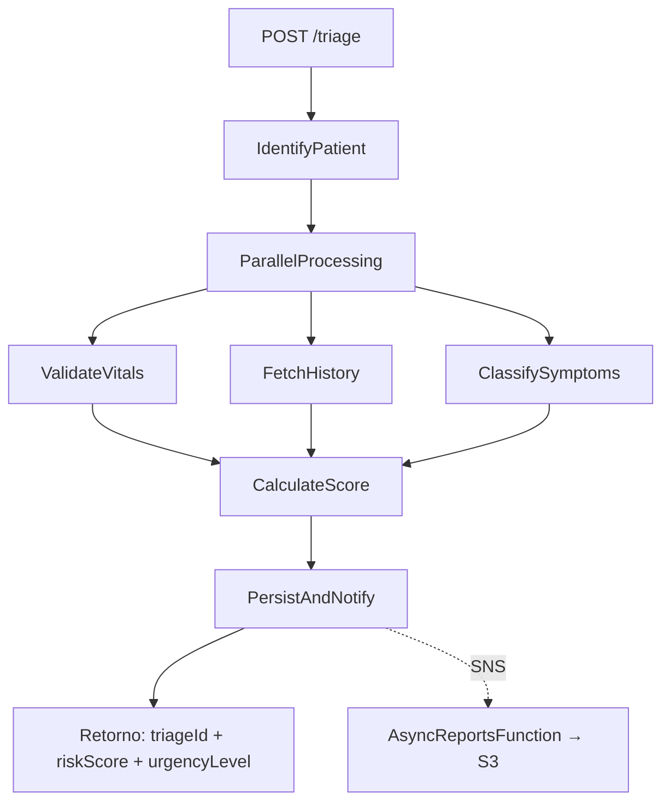

# MediFlow — MVP Serverless de Triagem Clínica

## Estrutura Final

```
mediflow-project/
├── template.yaml                  ← SAM template (infra completa)
├── statemachine/
│   └── triage.asl.json            ← ASL da State Machine
└── src/
    ├── identify/app.py            ← Identifica paciente (mock)
    ├── vitals/app.py              ← Valida sinais vitais
    ├── history/app.py             ← Busca doenças crônicas (mock)
    ├── symptoms/app.py            ← Classifica sintomas reportados
    ├── score/app.py               ← Motor White-Box (3 dimensões)
    ├── persist/app.py             ← Salva DynamoDB + publica SNS
    └── async_reports/app.py       ← Gera relatório JSON → S3
```

## Recursos AWS Provisionados (template.yaml)

| Recurso | Tipo | Detalhe |
|---|---|---|
| API Gateway | `POST /triage` | Entrada síncrona via REST |
| Step Functions | Express Workflow | Orquestra 6 Lambdas síncronas |
| 6 Lambdas (síncronas) | Python 3.12 | Identify, Vitals, History, Symptoms, Score, Persist |
| 1 Lambda (assíncrona) | Python 3.12 | AsyncReports (trigger SNS) |
| DynamoDB | `TriageTable` | PK = `triageId`, PAY_PER_REQUEST |
| SNS | `TriageEventsTopic` | Evento `triage.completed` |
| S3 | `ReportsBucket` | Relatórios em `reports/YYYY/MM/DD/` |

## Credenciais AWS

**Não são necessárias credenciais no código.** O SAM cria roles IAM automaticamente via policies declarativas. Para deploy, basta configurar o AWS CLI:

```bash
aws configure
# Informe: Access Key ID, Secret Access Key, Region e Output Format
```

## Segurança e Privacidade (LGPD & KMS)

Para garantir conformidade com as melhores práticas de segurança e com a LGPD:

1. **Criptografia em Repouso (KMS):** 
   - Foi criada uma **Customer Managed Key (CMK)** no AWS KMS (`MediFlowKMSKey`).
   - Todos os dados salvos no DynamoDB, mensagens no SNS e relatórios no S3 são automaticamente criptografados usando essa chave.
   - Políticas IAM (Least Privilege) garantem que apenas as Lambdas autorizadas possam descriptografar/usar a chave.

2. **Retenção e Expurgo (TTL - LGPD):**
   - O DynamoDB possui a funcionalidade de Time To Live (TTL) habilitada.
   - Cada registro de triagem salva a propriedade `expiresAt` configurada para **90 dias** após a criação.
   - Após 90 dias, o próprio DynamoDB expurga e deleta os dados automaticamente, respeitando o ciclo de vida e minimização da LGPD.

3. **Logs Seguros e Anonimização:**
   - As funções Lambda utilizam `logging` para registrar apenas dados operacionais (ex: `RequestId`, `TriageId`, status e scores).
   - Dados sensíveis e PII (Personally Identifiable Information) como nome, sinais vitais exatos e sintomas descritivos não são trafegados nos logs em texto aberto do CloudWatch.

## Relatórios e Dashboards (Amazon QuickSight)

O projeto já sobe com um **Data Lake Analítico** pré-configurado, permitindo que você crie painéis gerenciais no Amazon QuickSight sem esforço.

1. **A Fonte de Dados (S3):** A função `AsyncReports` salva os relatórios de todas as triagens em arquivos JSON no S3 (`ReportsBucket`).
2. **O Estruturador (AWS Glue Crawler):** O recurso `mediflow-reports-crawler` está agendado para rodar toda madrugada. Ele entra no S3, lê os JSONs, entende as colunas e cria a tabela automaticamente no banco de dados `mediflow_analytics_db`. Se você quiser que o painel atualize antes do agendamento, basta rodar o Crawler manualmente no console da AWS.
3. **A Camada SQL (Amazon Athena):** Imediatamente, a tabela estará disponível no Amazon Athena, onde você pode usar queries SQL padrão para explorar os dados.
4. **O Dashboard (QuickSight):** Para criar seu painel, abra o Amazon QuickSight, crie um Dataset apontando para o "Athena", escolha o banco `mediflow_analytics_db` e a tabela `reports`. Agora é só arrastar as métricas para a tela:
   - *Total de triagens (Contagem)*
   - *Gráfico de pizza com a distribuição de `urgencylevel` (CRITICAL, HIGH, etc).*
   - *Gráfico em linha de pacientes atendidos por dia (`eventtimestamp`).*

## Fluxo da State Machine



## Motor de Scoring — 3 Dimensões

O score final é composto por 3 dimensões independentes somadas:

### Dimensão 1: Sinais Vitais

| Condição | Pontos |
|---|---|
| FC > 120 bpm | +30 |
| FC > 100 bpm | +15 |
| FC < 50 bpm | +25 |
| SpO2 < 90% | +35 |
| SpO2 < 94% | +20 |
| Temp ≥ 39.5°C | +25 |
| Temp ≥ 38.0°C | +10 |
| Temp < 35.0°C | +20 |
| PAS < 80 mmHg | +35 |
| PAS < 90 mmHg | +20 |
| PAS > 180 mmHg | +25 |

### Dimensão 2: Doenças Crônicas

| Condição | Pontos |
|---|---|
| Insuficiência cardíaca | +20 |
| Diabetes tipo 1 | +15 |
| DPOC | +12 |
| Diabetes tipo 2 | +10 |
| Hipertensão | +8 |
| Asma | +7 |
| Obesidade | +5 |

### Dimensão 3: Sintomas Reportados

| Sintoma (key) | Severidade | Pontos |
|---|---|---|
| `perda_consciencia` | CRITICAL | +40 |
| `convulsao` | CRITICAL | +40 |
| `paralisia_subita` | CRITICAL | +40 |
| `dor_no_peito` | CRITICAL | +35 |
| `dificuldade_respiratoria` | CRITICAL | +35 |
| `confusao_mental` | CRITICAL | +30 |
| `dor_abdominal_intensa` | HIGH | +25 |
| `sangramento_ativo` | HIGH | +25 |
| `dor_de_cabeca_intensa` | HIGH | +20 |
| `dor_toracica_ao_respirar` | HIGH | +20 |
| `vomito_persistente` | HIGH | +15 |
| `febre_persistente` | HIGH | +15 |
| `edema_membros` | HIGH | +15 |
| `palpitacoes` | MEDIUM | +12 |
| `tontura` | MEDIUM | +10 |
| `nausea` | MEDIUM | +8 |
| `diarreia` | MEDIUM | +8 |
| `tosse_persistente` | MEDIUM | +8 |
| `dor_de_cabeca_leve` | MEDIUM | +5 |
| `dor_muscular` | MEDIUM | +5 |
| `dor_nas_costas` | LOW | +4 |
| `dor_de_garganta` | LOW | +3 |
| `fadiga` | LOW | +3 |
| `coriza` | LOW | +2 |
| `coceira` | LOW | +2 |

**Bônus de correlação:** Se ≥2 sintomas CRITICAL, aplica +15 por cada adicional.

### Classificação Final

- `LOW` → score < 25
- `MEDIUM` → 25 ≤ score < 50
- `HIGH` → 50 ≤ score < 80
- `CRITICAL` → score ≥ 80

## Frontend (Interface de Usuário)

Este projeto acompanha uma **Interface de Triagem** bonita e moderna para que enfermeiros e equipe médica insiram os dados facilmente, sem precisarem lidar com linhas de comando.

**Tecnologias:** HTML5, CSS3 Vanilla (Design *Glassmorphism* e Dark Mode) e JavaScript.

### Como Testar Imediatamente (Sem Deploy na Nuvem)

Você pode testar e ver a inteligência clínica funcionando agora mesmo, no seu computador:

1. Abra a pasta do projeto no explorador de arquivos.
2. Dê dois cliques no arquivo: `frontend/index.html`.
3. Ele abrirá no seu navegador de internet padrão (Chrome, Edge, etc).
4. O sistema já vem com a chave **"Modo Simulação (Offline)"** ativada.
5. Preencha a frequência cardíaca, selecione sintomas como "Falta de Ar" e "Dor no Peito", e clique em **Executar Triagem**. O JavaScript do Frontend vai emular a inteligência do "Motor de Score" do backend para você ver os alertas e cores de urgência em tempo real.

### Usando com a Nuvem

Quando você fizer o deploy do projeto na AWS, basta:
1. Desativar a chavinha do "Modo Simulação".
2. Colar a URL do **API Gateway** gerada no console (campo URL da API AWS).
3. O frontend enviará os JSONs de verdade para os seus Lambdas na AWS.

## Como Fazer Deploy do Backend na AWS

```bash
# Build
sam build

# Deploy guiado (primeira vez)
sam deploy --guided

# Testar
curl -X POST https://<api-id>.execute-api.<region>.amazonaws.com/Prod/triage \
  -H "Content-Type: application/json" \
  -d '{
    "patientId": "P003",
    "heartRate": 130,
    "spo2": 88,
    "temperature": 39.8,
    "systolicBP": 75,
    "symptoms": ["dor_no_peito", "dificuldade_respiratoria", "tontura"]
  }'
```

O payload acima resultaria em score **CRITICAL** (taquicardia severa + hipoxemia crítica + febre alta + hipotensão severa + 3 doenças crônicas do P003 + dor no peito + dispneia + tontura + bônus correlação).
