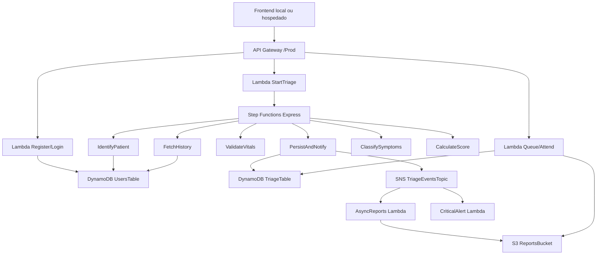

# MediFlow - MVP Serverless de Triagem Clinica

MediFlow e um MVP academico de triagem clinica digital. O projeto simula um fluxo de entrada de pacientes, calcula uma prioridade de atendimento com regras explicaveis, organiza a fila por risco e permite que um medico acompanhe as triagens em um dashboard.

> Este projeto e educacional. Ele nao substitui avaliacao clinica profissional e nao deve ser usado em producao sem revisao medica, seguranca adequada, autenticacao forte e validacao regulatoria.

## Status Atual

- Backend serverless publicado na AWS com AWS SAM.
- Frontend vanilla em `frontend/`, rodando localmente e apontando para a API AWS.
- Cadastro com selecao de perfil: `Paciente` ou `Medico`.
- Pacientes sao redirecionados para a tela de triagem.
- Medicos sao redirecionados para o dashboard de triagens.
- Cadastro de paciente coleta historico de saude e medicamentos.
- Cadastro de medico coleta especialidade e CRM.
- Triagens sao processadas por Step Functions Express e persistidas no DynamoDB.
- Eventos de triagem sao publicados em SNS.
- Registros de atendimento sao arquivados em S3.

API publicada:

```text
https://bn51l4hc7g.execute-api.us-east-1.amazonaws.com/Prod
```

Frontend local atual:

```text
http://127.0.0.1:8002/login.html
```

## Objetivo

O sistema demonstra uma arquitetura serverless para:

1. Cadastrar usuarios com perfil de paciente ou medico.
2. Autenticar usuarios de forma simplificada para o MVP.
3. Receber sinais vitais e sintomas de pacientes.
4. Combinar sinais vitais, historico clinico e sintomas reportados.
5. Calcular score de risco e nivel de urgencia.
6. Persistir a triagem em uma fila priorizada.
7. Permitir ao medico visualizar e atender pacientes.
8. Arquivar o atendimento e gerar eventos assicronos.

## Stack

| Camada | Tecnologia |
|---|---|
| Frontend | HTML, CSS, JavaScript vanilla |
| Backend | Python 3.12 em AWS Lambda |
| Infraestrutura | AWS SAM / CloudFormation |
| API | Amazon API Gateway REST API |
| Orquestracao | AWS Step Functions Express |
| Banco | Amazon DynamoDB |
| Eventos | Amazon SNS |
| Arquivos | Amazon S3 |
| Criptografia | AWS KMS |
| Logs | Amazon CloudWatch Logs |

## Estrutura do Projeto

```text
mediflow-project/
├── README.md
├── samconfig.toml
├── template.yaml
├── infra/
│   └── statemachine/
│       └── triage.asl.json
├── frontend/
│   ├── login.html
│   ├── index.html
│   ├── dashboard.html
│   └── assets/
│       ├── css/
│       │   └── style.css
│       └── js/
│           ├── config.js
│           ├── auth.js
│           ├── app.js
│           └── dashboard.js
├── src/
│   └── functions/
│       ├── api/
│       │   ├── auth/user/
│       │   │   ├── login/app.py
│       │   │   └── register/app.py
│       │   └── triage/
│       │       ├── start/app.py
│       │       ├── queue/app.py
│       │       └── attend/app.py
│       ├── workflow/
│       │   ├── identify/app.py
│       │   ├── vitals/app.py
│       │   ├── history/app.py
│       │   ├── symptoms/app.py
│       │   ├── score/app.py
│       │   └── persist/app.py
│       └── async/
│           ├── reports/app.py
│           └── alerts/app.py
└── tests/
    ├── test_auth.py
    ├── test_final_flow.py
    └── test_locally.py
```

## Arquitetura



## Fluxo Funcional

1. Usuario acessa `login.html`.
2. No cadastro, escolhe `Paciente` ou `Medico`.
3. Se for paciente, preenche historico de saude e medicamentos.
4. Se for medico, preenche especialidade e CRM.
5. Login/cadastro salva o perfil no `localStorage` do navegador.
6. Paciente e direcionado para `index.html`.
7. Medico e direcionado para `dashboard.html`.
8. Paciente envia sinais vitais e sintomas para `POST /triage`.
9. API Gateway chama `StartTriageFunction`.
10. Step Functions executa identificacao, validacao, historico, sintomas, score e persistencia.
11. Resultado volta para o paciente com score, urgencia e explicacao.
12. Dashboard medico consulta `GET /triage/queue` a cada 2 segundos.
13. Medico registra atendimento em `POST /triage/{triageId}/attend`.
14. Atendimento sai da fila ativa e um JSON e salvo no S3.

## Frontend

O frontend esta em `frontend/` e possui tres telas:

| Tela | Arquivo | Descricao |
|---|---|---|
| Login/Cadastro | `frontend/login.html` | Cadastro, login e selecao de perfil |
| Triagem | `frontend/index.html` | Formulario do paciente com sinais vitais e sintomas |
| Dashboard | `frontend/dashboard.html` | Fila medica com alertas e botao de atendimento |

Configuracao principal:

```js
const CONFIG = {
    LOCAL_MODE: false,
    API_URL: 'https://bn51l4hc7g.execute-api.us-east-1.amazonaws.com/Prod'
};
```

Para rodar localmente:

```bash
cd frontend
python3 -m http.server 8002
```

Acesse:

```text
http://127.0.0.1:8002/login.html
```

### Modo Local

O arquivo `frontend/assets/js/config.js` ainda possui suporte a `LOCAL_MODE: true`, que usa `localStorage` para cadastro, login, fila e triagens sem chamar AWS. No estado atual do projeto, `LOCAL_MODE` esta `false`, usando a API publicada.

Usuarios locais sem AWS, quando `LOCAL_MODE: true`:

| Perfil | CPF | Senha | Destino |
|---|---|---|---|
| Paciente | `11111111111` | `123456` | `index.html` |
| Medico | `22222222222` | `123456` | `dashboard.html` |

## Backend AWS

Stack publicada:

```text
mediflow-v2026
```

Regiao:

```text
us-east-1
```

Outputs do deploy:

| Output | Valor |
|---|---|
| `BaseApiEndpoint` | `https://bn51l4hc7g.execute-api.us-east-1.amazonaws.com/Prod` |
| `TriageApiEndpoint` | `https://bn51l4hc7g.execute-api.us-east-1.amazonaws.com/Prod/triage` |
| `TriageTableName` | `mediflow-v2026-TriageTable-15ERFN48VAMQR` |
| `ReportsBucketName` | `mediflow-v2026-reportsbucket-xckvwemey7tz` |
| `TriageEventsTopicArn` | `arn:aws:sns:us-east-1:722851019641:mediflow-v2026-TriageEventsTopic-XKcrS81pA2m4` |
| `TriageStateMachineArn` | `arn:aws:states:us-east-1:722851019641:stateMachine:TriageStateMachine-zWYspBdFNf1I` |

## Documentacao da API

Base URL:

```text
https://bn51l4hc7g.execute-api.us-east-1.amazonaws.com/Prod
```

Headers comuns:

```http
Content-Type: application/json
```

Autenticacao: nao ha autenticacao real neste MVP. As rotas estao abertas para simplificar a demonstracao academica.

### POST /auth/register

Cadastra um usuario.

URL:

```text
POST /auth/register
```

#### Cadastro de Paciente

Request:

```json
{
  "fullName": "Joao Paciente",
  "cpf": "11111111111",
  "password": "123456",
  "role": "patient",
  "chronicConditions": ["diabetes", "hipertensao"],
  "medications": ["Metformina", "Losartana"],
  "specialty": "",
  "crm": ""
}
```

Response `201`:

```json
{
  "message": "Cadastro realizado com sucesso!"
}
```

#### Cadastro de Medico

Request:

```json
{
  "fullName": "Dra. Ana Medica",
  "cpf": "22222222222",
  "password": "123456",
  "role": "doctor",
  "chronicConditions": [],
  "medications": [],
  "specialty": "Clinica medica",
  "crm": "CRM-SP 123456"
}
```

Response `201`:

```json
{
  "message": "Cadastro realizado com sucesso!"
}
```

Erros comuns:

| Status | Quando |
|---:|---|
| `400` | Corpo vazio, CPF/senha ausentes, perfil invalido ou CPF ja cadastrado |
| `500` | Erro interno ao acessar DynamoDB |

Exemplo curl:

```bash
curl -X POST https://bn51l4hc7g.execute-api.us-east-1.amazonaws.com/Prod/auth/register \
  -H "Content-Type: application/json" \
  -d '{
    "fullName": "Joao Paciente",
    "cpf": "11111111111",
    "password": "123456",
    "role": "patient",
    "chronicConditions": ["diabetes", "hipertensao"],
    "medications": ["Metformina"],
    "specialty": "",
    "crm": ""
  }'
```

### POST /auth/login

Valida CPF e senha e retorna o perfil.

URL:

```text
POST /auth/login
```

Request:

```json
{
  "cpf": "11111111111",
  "password": "123456"
}
```

Response `200` para paciente:

```json
{
  "cpf": "11111111111",
  "fullName": "Joao Paciente",
  "role": "patient",
  "chronicConditions": ["diabetes", "hipertensao"],
  "medications": ["Metformina", "Losartana"],
  "specialty": "",
  "crm": ""
}
```

Response `200` para medico:

```json
{
  "cpf": "22222222222",
  "fullName": "Dra. Ana Medica",
  "role": "doctor",
  "chronicConditions": [],
  "medications": [],
  "specialty": "Clinica medica",
  "crm": "CRM-SP 123456"
}
```

Erros comuns:

| Status | Quando |
|---:|---|
| `400` | Corpo vazio ou CPF/senha ausentes |
| `401` | Usuario nao encontrado ou senha incorreta |
| `500` | Erro interno |

Exemplo curl:

```bash
curl -X POST https://bn51l4hc7g.execute-api.us-east-1.amazonaws.com/Prod/auth/login \
  -H "Content-Type: application/json" \
  -d '{"cpf":"11111111111","password":"123456"}'
```

### POST /triage

Inicia uma triagem. A Lambda `StartTriageFunction` chama a Step Function `TriageStateMachine` de forma sincrona.

URL:

```text
POST /triage
```

Request:

```json
{
  "patientId": "11111111111",
  "heartRate": 130,
  "spo2": 88,
  "temperature": 39.8,
  "systolicBP": 75,
  "symptoms": ["dor_no_peito", "dificuldade_respiratoria", "tontura"],
  "chronicConditions": ["diabetes"],
  "medications": ["Metformina"],
  "fullName": "Joao Paciente"
}
```

Campos:

| Campo | Tipo | Obrigatorio | Descricao |
|---|---|---|---|
| `patientId` | string | Sim | CPF do paciente |
| `heartRate` | number | Sim | Frequencia cardiaca em bpm |
| `spo2` | number | Sim | Saturacao de oxigenio em porcentagem |
| `temperature` | number | Sim | Temperatura em Celsius |
| `systolicBP` | number | Sim | Pressao arterial sistolica em mmHg |
| `symptoms` | string[] | Sim | Lista de sintomas por chave |
| `chronicConditions` | string[] | Nao | Historico enviado pelo frontend; no fluxo AWS o historico tambem e buscado no DynamoDB |
| `medications` | string[] | Nao | Medicamentos informados no cadastro |
| `fullName` | string | Nao | Nome do paciente |

Response `200`:

```json
{
  "triageId": "T-1779100000",
  "riskScore": 220,
  "urgencyLevel": "CRITICAL",
  "explanation": [
    "[VITAL] Taquicardia severa (FC=130.0 bpm)",
    "[VITAL] Hipoxemia critica (SpO2=88.0%)",
    "[VITAL] Febre alta (T=39.8°C)",
    "[VITAL] Hipotensao severa (PAS=75.0 mmHg)",
    "[SINTOMA:CRITICAL] Dor no peito (+35 pts)",
    "[SINTOMA:CRITICAL] Dificuldade respiratoria / Dispneia (+35 pts)",
    "[CORRELACAO] 2 sintomas criticos simultaneos (+15 pts)"
  ]
}
```

Erros comuns:

| Status | Quando |
|---:|---|
| `500` | Falha na execucao da Step Function ou erro interno |

Exemplo curl:

```bash
curl -X POST https://bn51l4hc7g.execute-api.us-east-1.amazonaws.com/Prod/triage \
  -H "Content-Type: application/json" \
  -d '{
    "patientId": "11111111111",
    "heartRate": 130,
    "spo2": 88,
    "temperature": 39.8,
    "systolicBP": 75,
    "symptoms": ["dor_no_peito", "dificuldade_respiratoria", "tontura"],
    "fullName": "Joao Paciente"
  }'
```

### GET /triage/queue

Lista triagens com status `WAITING`, ordenadas por maior `riskScore`.

URL:

```text
GET /triage/queue
```

Response `200`:

```json
[
  {
    "triageId": "T-1779100000",
    "patientId": "11111111111",
    "fullName": "Joao Paciente",
    "riskScore": 220,
    "urgencyLevel": "CRITICAL",
    "scoreBreakdown": {
      "vitalsScore": 125,
      "historyScore": 0,
      "symptomsScore": 95
    },
    "explanation": ["..."],
    "vitals": {
      "vitalsValid": true,
      "vitals": {
        "heartRate": { "value": 130, "unit": "bpm", "status": "NORMAL" }
      }
    },
    "chronicConditions": ["diabetes"],
    "reportedSymptoms": [],
    "createdAt": "2026-05-18T11:00:00Z",
    "eventTimestamp": "2026-05-18T11:00:00Z",
    "expiresAt": 1787000000,
    "status": "WAITING"
  }
]
```

Erros comuns:

| Status | Quando |
|---:|---|
| `500` | Erro ao consultar DynamoDB |

Exemplo curl:

```bash
curl https://bn51l4hc7g.execute-api.us-east-1.amazonaws.com/Prod/triage/queue
```

### POST /triage/{triageId}/attend

Marca uma triagem como atendida e arquiva um registro JSON no S3.

URL:

```text
POST /triage/{triageId}/attend
```

Path parameter:

| Campo | Tipo | Descricao |
|---|---|---|
| `triageId` | string | ID da triagem retornado por `POST /triage` |

Response `200`:

```json
{
  "message": "Atendimento registrado com sucesso!",
  "s3Key": "attended/2026/05/18/T-1779100000.json"
}
```

Erros comuns:

| Status | Quando |
|---:|---|
| `400` | `triageId` ausente |
| `404` | Triagem nao encontrada |
| `500` | Erro ao atualizar DynamoDB ou salvar no S3 |

Exemplo curl:

```bash
curl -X POST https://bn51l4hc7g.execute-api.us-east-1.amazonaws.com/Prod/triage/T-1779100000/attend
```

## Sintomas Aceitos

O catalogo de sintomas fica em `src/functions/workflow/symptoms/app.py`.

| Chave | Severidade | Peso |
|---|---|---:|
| `dor_no_peito` | `CRITICAL` | 35 |
| `dificuldade_respiratoria` | `CRITICAL` | 35 |
| `perda_consciencia` | `CRITICAL` | 40 |
| `convulsao` | `CRITICAL` | 40 |
| `paralisia_subita` | `CRITICAL` | 40 |
| `confusao_mental` | `CRITICAL` | 30 |
| `dor_abdominal_intensa` | `HIGH` | 25 |
| `sangramento_ativo` | `HIGH` | 25 |
| `vomito_persistente` | `HIGH` | 15 |
| `febre_persistente` | `HIGH` | 15 |
| `dor_de_cabeca_intensa` | `HIGH` | 20 |
| `dor_toracica_ao_respirar` | `HIGH` | 20 |
| `edema_membros` | `HIGH` | 15 |
| `tontura` | `MEDIUM` | 10 |
| `nausea` | `MEDIUM` | 8 |
| `diarreia` | `MEDIUM` | 8 |
| `dor_de_cabeca_leve` | `MEDIUM` | 5 |
| `dor_muscular` | `MEDIUM` | 5 |
| `tosse_persistente` | `MEDIUM` | 8 |
| `palpitacoes` | `MEDIUM` | 12 |
| `dor_de_garganta` | `LOW` | 3 |
| `coriza` | `LOW` | 2 |
| `fadiga` | `LOW` | 3 |
| `coceira` | `LOW` | 2 |
| `dor_nas_costas` | `LOW` | 4 |

Sintomas desconhecidos recebem severidade `MEDIUM` e peso `5`.

## Motor de Scoring

O score e white-box: cada ponto adicionado gera uma justificativa em `explanation`.

### Sinais Vitais

| Condicao | Pontos |
|---|---:|
| FC > 120 bpm | +30 |
| FC > 100 bpm | +15 |
| FC < 50 bpm | +25 |
| SpO2 < 90% | +35 |
| SpO2 < 94% | +20 |
| Temperatura >= 39.5 C | +25 |
| Temperatura >= 38.0 C | +10 |
| Temperatura < 35.0 C | +20 |
| PAS < 80 mmHg | +35 |
| PAS < 90 mmHg | +20 |
| PAS > 180 mmHg | +25 |

### Doencas Cronicas

| Condicao | Pontos |
|---|---:|
| `insuficiencia_cardiaca` | +20 |
| `diabetes_tipo_1` | +15 |
| `diabetes_tipo_2` | +10 |
| `hipertensao` | +8 |
| `asma` | +7 |
| `obesidade` | +5 |
| `dpoc` | +12 |
| Condicao nao mapeada | +5 |

### Classificacao Final

| Score | Urgencia |
|---:|---|
| `< 25` | `LOW` |
| `25 - 49` | `MEDIUM` |
| `50 - 79` | `HIGH` |
| `>= 80` | `CRITICAL` |

Se houver dois ou mais sintomas criticos, o motor adiciona bonus de correlacao:

```text
15 * (quantidade_de_sintomas_criticos - 1)
```

## Deploy

Pre-requisitos:

- AWS CLI configurado.
- AWS SAM CLI instalado.
- Credenciais AWS com permissao para CloudFormation, Lambda, API Gateway, DynamoDB, SNS, S3, KMS, IAM e Step Functions.

Build:

```bash
sam build
```

Deploy guiado:

```bash
sam deploy --guided
```

Configuracao atual em `samconfig.toml`:

```toml
stack_name = "mediflow-v2026"
region = "us-east-1"
capabilities = "CAPABILITY_IAM"
resolve_s3 = true
confirm_changeset = true
disable_rollback = true
```

Depois do deploy, copie `BaseApiEndpoint` para `frontend/assets/js/config.js` e deixe:

```js
LOCAL_MODE: false
```

## Testes

Testes locais disponiveis:

```bash
python3 tests/test_auth.py
python3 tests/test_locally.py
python3 -m unittest tests/test_final_flow.py
```

Validacoes usadas durante o desenvolvimento:

```bash
node --check frontend/assets/js/auth.js
node --check frontend/assets/js/config.js
python3 -B -c "compile(open('src/functions/api/auth/user/register/app.py').read(), 'register', 'exec')"
sam build
```

## Seguranca e Privacidade

Para o escopo academico do MVP, algumas simplificacoes foram mantidas de proposito:

- Senhas sao armazenadas em texto puro.
- API Gateway nao exige autenticacao.
- O frontend usa `localStorage` para manter o perfil logado.
- Rotas medicas dependem do `role` retornado pelo login/cadastro.
- CORS permite origem ampla.

Medidas ja presentes:

- Criptografia em repouso com KMS em DynamoDB, SNS e S3.
- Politicas IAM por funcao no template SAM.
- TTL em `TriageTable` via atributo `expiresAt`.
- Separacao entre fluxo sincrono de triagem e processamento assincrono de eventos.

Para uma versao de producao, seria necessario:

- Usar Amazon Cognito ou JWT assinado.
- Aplicar hash de senha com algoritmo apropriado.
- Proteger rotas de medico no backend.
- Restringir CORS ao dominio real do frontend.
- Reduzir dados sensiveis em logs.
- Revisar regras clinicas com profissional habilitado.

## Limitacoes Conhecidas do MVP

- O identificador do paciente e o CPF (`patientId` no fluxo de triagem).
- `PatientsTable` existe no template, mas o modelo funcional do MVP usa o CPF em `UsersTable` como origem dos dados do paciente.
- A fila e ordenada por `riskScore` no backend, nao por uma combinacao completa de peso clinico e tempo.
- A tela de paciente mostra estimativa de espera apenas no modo local.
- O botao de limpar fila no dashboard limpa apenas armazenamento local quando a API AWS esta ativa; ele nao apaga triagens no DynamoDB.
- O ID de triagem usa timestamp em segundos (`T-<timestamp>`), suficiente para demo, mas pode colidir sob alta concorrencia.

## Comandos Uteis

Subir frontend local:

```bash
cd frontend
python3 -m http.server 8002
```

Validar template SAM:

```bash
sam validate
```

Build SAM:

```bash
sam build
```

Deploy SAM:

```bash
sam deploy
```

Ver outputs da stack:

```bash
aws cloudformation describe-stacks \
  --stack-name mediflow-v2026 \
  --region us-east-1 \
  --query "Stacks[0].Outputs"
```

## Proximos Passos Recomendados

1. Hospedar o frontend em Amplify Hosting ou S3 + CloudFront.
2. Atualizar o README com a URL publica do frontend hospedado.
3. Criar um roteiro de demonstracao para banca: cadastro paciente, triagem critica, dashboard medico, atendimento.
4. Se o projeto evoluir alem do MVP, substituir autenticacao simplificada por Cognito.
