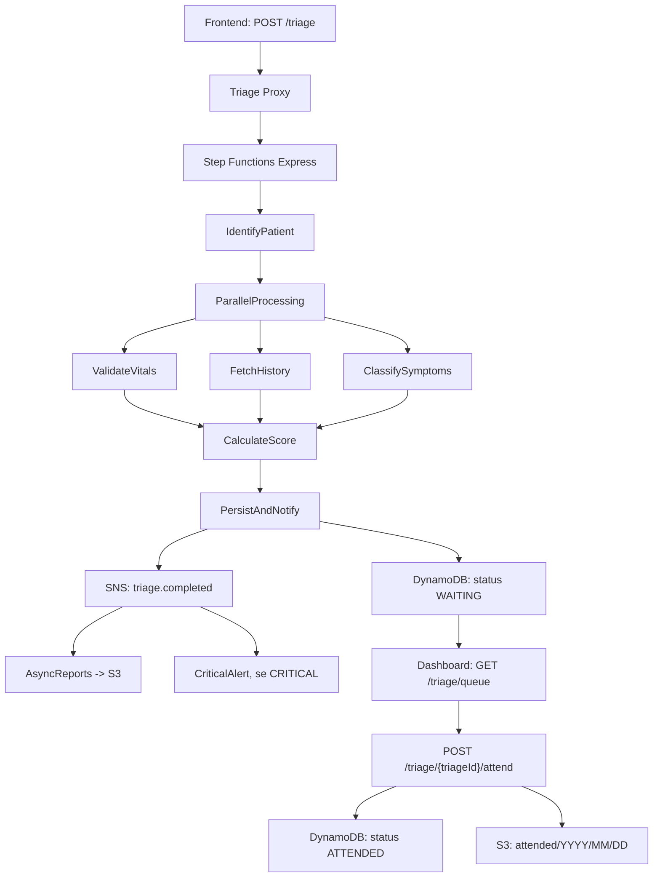

# MediFlow — MVP Serverless de Triagem Clínica

MediFlow é um MVP de triagem clínica digital construído para demonstrar uma arquitetura serverless na AWS. O objetivo do trabalho é simular um fluxo real de entrada de pacientes, calcular uma prioridade clínica de forma transparente, organizar a fila por risco e registrar os eventos para atendimento e análise posterior.

O projeto combina:

- Uma interface web simples para cadastro, login, triagem e acompanhamento da fila.
- Uma API serverless com AWS SAM, API Gateway, Lambda, Step Functions, DynamoDB, SNS, S3 e KMS.
- Um motor de scoring white-box, com regras explícitas para sinais vitais, doenças crônicas e sintomas.
- Persistência e geração assíncrona de relatórios operacionais.

> Este projeto é um protótipo educacional. Ele não substitui avaliação clínica profissional nem deve ser usado em produção sem revisão médica, segurança, autenticação adequada e validação regulatória.

## Objetivo do Trabalho

O trabalho propõe implementar uma solução de triagem médica com foco em:

1. Receber dados de um paciente autenticado.
2. Validar sinais vitais informados na triagem.
3. Combinar sinais vitais, histórico clínico e sintomas reportados.
4. Calcular uma classificação de urgência explicável.
5. Inserir o paciente em uma fila priorizada.
6. Permitir que a equipe visualize pacientes críticos e registre atendimento.
7. Persistir dados e eventos para rastreabilidade e relatórios.
8. Aplicar boas práticas de arquitetura serverless, segurança em repouso e minimização de dados.

## Estado Atual

O repositório já contém:

- Infraestrutura AWS SAM em `template.yaml`.
- State Machine em `infra/statemachine/triage.asl.json`.
- Lambdas de autenticação, triagem, fila, atendimento, alerta e relatório.
- Frontend vanilla em `frontend/`.
- Testes locais exploratórios em Python.

Também existem pendências conhecidas, listadas em [Pendências Técnicas](#pendencias-tecnicas).

## Estrutura do Projeto

```text
mediflow-project/
├── README.md
├── samconfig.toml
├── template.yaml
├── infra/
│   └── statemachine/
│       └── triage.asl.json
├── frontend/
│   ├── login.html
│   ├── index.html
│   ├── dashboard.html
│   └── assets/
│       ├── css/
│       │   └── style.css
│       └── js/
│           ├── config.js
│           ├── auth.js
│           ├── app.js
│           └── dashboard.js
├── src/
│   └── functions/
│       ├── api/
│       │   ├── auth/user/
│       │   │   ├── login/app.py
│       │   │   └── register/app.py
│       │   └── triage/
│       │       ├── start/app.py
│       │       ├── queue/app.py
│       │       └── attend/app.py
│       ├── workflow/
│       │   ├── identify/app.py
│       │   ├── vitals/app.py
│       │   ├── history/app.py
│       │   ├── symptoms/app.py
│       │   ├── score/app.py
│       │   └── persist/app.py
│       └── async/
│           ├── reports/app.py
│           └── alerts/app.py
└── tests/
    ├── test_auth.py
    ├── test_final_flow.py
    └── test_locally.py
```

## Arquitetura AWS

| Recurso | Papel |
|---|---|
| API Gateway | Expõe endpoints REST para frontend e dashboard. |
| Lambda | Executa autenticação, triagem, fila, atendimento, alerta e relatórios. |
| Step Functions Express | Orquestra o fluxo síncrono de triagem. |
| DynamoDB | Armazena usuários e triagens. |
| SNS | Publica evento `triage.completed` após a triagem. |
| S3 | Guarda relatórios e registros de atendimento. |
| KMS | Criptografia em repouso para DynamoDB, SNS e S3. |

## Endpoints

| Método | Rota | Função |
|---|---|---|
| `POST` | `/auth/register` | Cadastra usuário/paciente. |
| `POST` | `/auth/login` | Valida login e retorna perfil. |
| `POST` | `/triage` | Inicia a triagem via Step Functions. |
| `GET` | `/triage/queue` | Lista pacientes aguardando atendimento. |
| `POST` | `/triage/{triageId}/attend` | Marca paciente como atendido e arquiva registro no S3. |

## Fluxo de Triagem



## Motor de Scoring

O score é white-box: cada ponto adicionado é explicável no retorno da API. A classificação final é calculada a partir de três dimensões.

### 1. Sinais Vitais

| Condição | Pontos |
|---|---:|
| FC > 120 bpm | +30 |
| FC > 100 bpm | +15 |
| FC < 50 bpm | +25 |
| SpO2 < 90% | +35 |
| SpO2 < 94% | +20 |
| Temperatura >= 39.5°C | +25 |
| Temperatura >= 38.0°C | +10 |
| Temperatura < 35.0°C | +20 |
| PAS < 80 mmHg | +35 |
| PAS < 90 mmHg | +20 |
| PAS > 180 mmHg | +25 |

### 2. Doenças Crônicas

| Condição | Pontos |
|---|---:|
| Insuficiência cardíaca | +20 |
| Diabetes tipo 1 | +15 |
| DPOC | +12 |
| Diabetes tipo 2 | +10 |
| Hipertensão | +8 |
| Asma | +7 |
| Obesidade | +5 |

### 3. Sintomas

Sintomas críticos, como dor no peito, dificuldade respiratória, perda de consciência, convulsão e paralisia súbita, recebem maior peso. Quando há dois ou mais sintomas críticos simultâneos, o motor aplica bônus de correlação.

Classificação final:

| Score | Urgência |
|---:|---|
| `< 25` | `LOW` |
| `25 - 49` | `MEDIUM` |
| `50 - 79` | `HIGH` |
| `>= 80` | `CRITICAL` |

## Frontend

O frontend está em `frontend/` e possui três telas principais:

- `login.html`: cadastro e login.
- `index.html`: formulário de triagem do paciente.
- `dashboard.html`: fila de pacientes aguardando atendimento.

O arquivo `frontend/assets/js/config.js` define a URL base da API:

```js
API_URL: 'https://c79cspmegc.execute-api.us-east-1.amazonaws.com/Prod'
```

Para testar localmente a interface, abra os arquivos HTML diretamente no navegador. Para usar a API real, o endpoint configurado precisa apontar para o output `BaseApiEndpoint` do deploy SAM.

## Deploy

Pré-requisitos:

- AWS CLI configurado.
- AWS SAM CLI instalado.
- Credenciais AWS com permissão para criar os recursos definidos no template.

Comandos:

```bash
sam build
sam deploy --guided
```

Após o deploy, copie o output `BaseApiEndpoint` para `frontend/assets/js/config.js`.

Exemplo de chamada:

```bash
curl -X POST https://<api-id>.execute-api.<region>.amazonaws.com/Prod/triage \
  -H "Content-Type: application/json" \
  -d '{
    "patientId": "11111111111",
    "heartRate": 130,
    "spo2": 88,
    "temperature": 39.8,
    "systolicBP": 75,
    "symptoms": ["dor_no_peito", "dificuldade_respiratoria", "tontura"]
  }'
```

## Segurança e Privacidade

O template já inclui:

- Criptografia em repouso com KMS para DynamoDB, SNS e S3.
- TTL no DynamoDB para expurgo automático de triagens após 90 dias.
- Políticas IAM declarativas por função.
- Separação entre fluxo síncrono de triagem e processamento assíncrono de relatórios.

Pontos que ainda precisam ser tratados antes de produção:

- Senhas devem ser armazenadas com hash seguro, nunca em texto puro.
- Autenticação deve usar tokens/sessões reais, não apenas `localStorage`.
- Logs devem evitar CPF, nome, sintomas livres e qualquer outro dado sensível.
- Erros internos não devem retornar detalhes técnicos ao frontend.
- Regras clínicas devem ser revisadas por profissional habilitado.

## Testes Locais

Existem três scripts de teste:

```bash
python3 tests/test_auth.py
python3 tests/test_locally.py
python3 -m unittest tests/test_final_flow.py
```

Os testes instalam um stub local de `boto3` quando o pacote não existe no ambiente, permitindo validar a lógica principal sem credenciais AWS.

## Pendências Técnicas

Pendências identificadas no estado atual do código:

- Corrigir `frontend/assets/js/auth.js`: o cadastro monta `payload`, mas envia uma variável inexistente chamada `conditions`.
- Alinhar a origem do histórico clínico: `PatientsTable` usa chave `patientId`, enquanto partes do fluxo usam `cpf`.
- Definir se usuários e pacientes devem viver na mesma tabela ou em tabelas separadas.
- Remover `__pycache__/` do controle de versão antes do primeiro commit.
- Criar `requirements.txt` ou instruções de ambiente para testes locais.
- Atualizar testes para mockar `boto3` sem depender da instalação real.
- Revisar CORS, autenticação, autorização e exposição de erros.

## Status do Repositório

Este repositório ainda não possui commits registrados na branch `main`. Todos os arquivos atuais aparecem como não rastreados no Git.

Antes de versionar, recomenda-se:

1. Corrigir as pendências críticas de execução.
2. Adicionar `.gitignore`.
3. Remover caches Python.
4. Rodar testes locais.
5. Fazer o primeiro commit com a base funcional do MVP.
